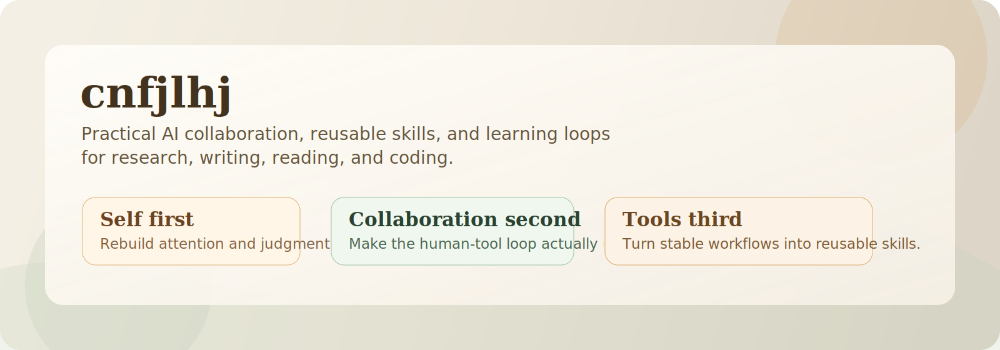

  

  <a href="https://github.com/cnfjlhj/ai-collab-playbook"><strong>Start Here</strong></a>&nbsp;&nbsp;·&nbsp;&nbsp;
  <a href="https://github.com/cnfjlhj/completion-learn">completion-learn</a>&nbsp;&nbsp;·&nbsp;&nbsp;
  <a href="https://github.com/cnfjlhj/collaborating-with-codex">collaborating-with-codex</a>&nbsp;&nbsp;·&nbsp;&nbsp;
  <a href="https://github.com/cnfjlhj/prompt-polisher">prompt-polisher</a>

---

I publish AI collaboration workflows, skills, and learning loops that I actually use in research and coding.

My core belief: **grow yourself first, then fix collaboration, then evolve tools.** Most people do it backwards.

If you're new here, start with [ai-collab-playbook](https://github.com/cnfjlhj/ai-collab-playbook) for the method and [completion-learn](https://github.com/cnfjlhj/completion-learn) for the learning loop.

## Start Here

| What you're looking for | Where to go |
|---|---|
| The full AI collaboration playbook | [ai-collab-playbook](https://github.com/cnfjlhj/ai-collab-playbook) |
| Turn finished tasks into personal growth | [completion-learn](https://github.com/cnfjlhj/completion-learn) |
| Use a second Codex session as sidecar | [collaborating-with-codex](https://github.com/cnfjlhj/collaborating-with-codex) |

## Repositories

| Repo | What it does |
|---|---|
| [ai-collab-playbook](https://github.com/cnfjlhj/ai-collab-playbook) | AI collaboration handbook for research, writing, reading, and coding |
| [completion-learn](https://github.com/cnfjlhj/completion-learn) | Post-task learning loop: self → collaboration → tool |
| [collaborating-with-codex](https://github.com/cnfjlhj/collaborating-with-codex) | Connect a second Codex CLI for prototyping, review, and second opinions |
| [prompt-polisher](https://github.com/cnfjlhj/prompt-polisher) | Turn rough notes into executable prompts |
| [writing-anti-ai](https://github.com/cnfjlhj/writing-anti-ai) | Make AI-generated writing sound human again |

## Themes

- AI collaboration that works in real research and coding workflows
- Skills that reduce ambiguity, not add ceremony
- Learning loops that improve the human before over-optimizing the tool

Everything published here is meant to be clear enough and complete enough to reuse directly.
